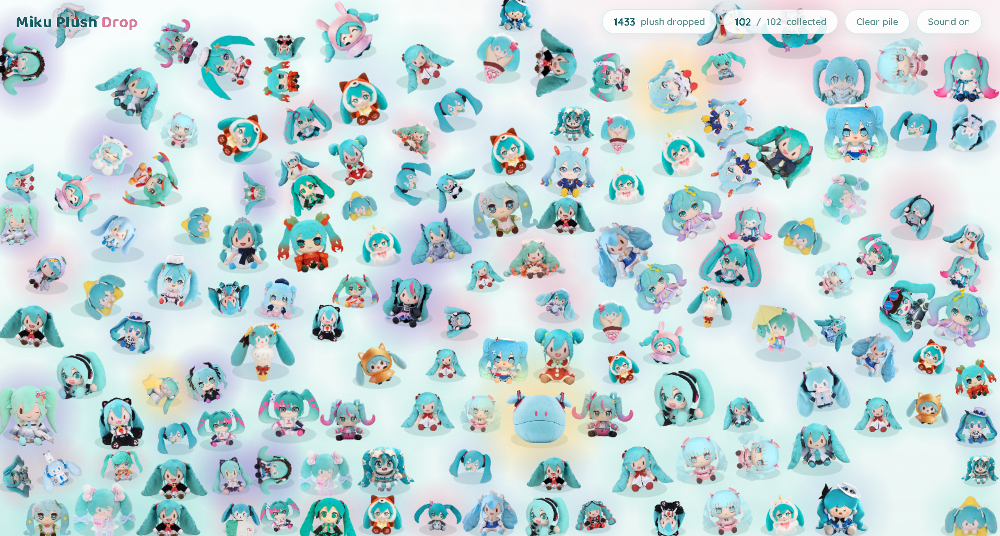
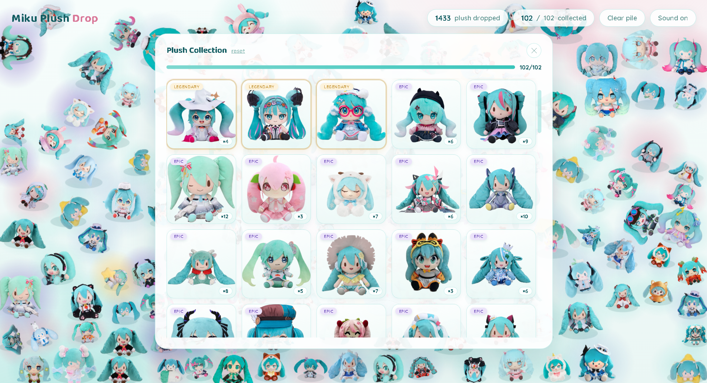

# Miku Plush Drop — Hatsune Miku plushie dropping game

**Live demo:** <https://aryanxsethi.github.io/Miku-Plush-Drop/>

A free fan-made **Vocaloid / Hatsune Miku** browser game: click anywhere to
drop a random **Hatsune Miku plush**. Each plushy falls with
2D [Matter.js](https://brm.io/matter-js/) physics and a pseudo-3D tumbling
animation, settles into a pile, and is recorded in your collection. Plushies
range over 100 base designs plus 7 hidden **secret** plushies, each with its
own weighting, rarity glow, and sound.

## Screenshots

| | |
|---|---|
|  |  |
| Dropping plushies onto the pile | Exploring your plush collection |

---

## Getting started

The site **must be served over HTTP** (browser localStorage and ES modules
work best over a local server). The project folder is
`MikuPlushDrop/` and it can live **on any drive** (`C:`, `D:`, `E:`, ...) at any
path — every file reference inside the project is relative, so nothing needs
to change when you move it.

From the project root:

```bash
cd /d D:\MikuPlushDrop          # any drive works: C:, D:, E:, ...
python -m http.server 8000
```

Then open <http://localhost:8000>.

> Opening `index.html` directly via `file://` is not supported: the app runs
> as ES modules, and browsers block module imports from `file://` (CORS). If
> you double-click the file you'll see a banner explaining how to start the
> server instead of the game.

### Directory layout

```
MikuPlushDrop/              # any drive, any path
├─ index.html               # page shell: canvas, HUD, collection modal
├─ style.css                # theme + UI (Miku teal/pink, collection grid, toasts)
├─ js/                      # app logic as ES modules
│  ├─ main.js               # entry point: event wiring + boot sequence
│  ├─ config.js             # all constants & tuning (rarities, weights, pity)
│  ├─ state.js              # shared runtime state, DOM refs, Matter engine
│  ├─ storage.js            # localStorage read/write + key normalization
│  ├─ assets.js             # image loading + fallback plushies
│  ├─ rarity.js             # rarity assignment, weighted picks, pity logic
│  ├─ audio.js              # WebAudio synth bank + playSound
│  ├─ ui.js                 # toasts, collection stats/grid, panel control
│  ├─ view.js               # rendering: halos, tumbling draw, baking
│  ├─ world.js              # resize/bounds, DPR tuning, spawn, trim
│  └─ game.js               # physics step, frame loop, collision impulses
├─ images/                  # 100 plush PNGs (plush_1.png … plush_100.png) + 7 secret eva PNGs
└─ ss/                      # screenshots used in this README
```

### Asset conventions

- **Plushies**: drop `plush_<n>.png` into `images/`. `loadPlushImages()` loads
  exactly `images/plush_1.png … images/plush_PLUSH_COUNT.png`, where
  `PLUSH_COUNT` is set in `js/config.js`. Bump `PLUSH_COUNT` when you add more.
- **Secrets**: every basename in `SECRET_PLUSHES` (`js/config.js`) is loaded
  from `images/<name>.png` as a stealth plushie — currently seven `eva*.png`
  images (see [Secret rarity](#secret-rarity)). Add a file to `images/` and
  its name to `SECRET_PLUSHES` to introduce a new secret.
- **Sound**: there are no audio files — all sounds are synthesized live with
  the built-in WebAudio synth bank in `js/audio.js`.

> Only files that actually exist on disk are requested, so the browser console
> never shows 404 errors for image probes.

---

## How it works

### Drop flow

1. The user clicks anywhere on the body.
2. `shouldDropSecret()` decides whether this drop is a secret (see below).
3. Otherwise `pickPlush()` picks a plushy via weighted random selection.
4. A Matter body drops in with an upward/angular velocity, tumbling to the
   floor and into the pile.
5. On land — `trim()` — the pile is capped at `state.maxPlush` (adaptive:
   `round(W×H / PLUSH_DENSITY)`, clamped to `[MAX_PLUSH_MIN, MAX_PLUSH_MAX]`).
6. The drop is recorded in `collection[key]` and persisted to localStorage.

### Rarity system

Each plushy gets a rarity: `common → uncommon → rare → epic → legendary → secret`.

Tier **weights** (drop odds):

| Tier | Weight | Label |
|------|--------|-------|
| common    | 40 | Common |
| uncommon  | 25 | Uncommon |
| rare      | 18 | Rare |
| epic      | 10 | Epic |
| legendary |  5 | Legendary |
| secret    |  0*| Secret |

\*Secret is *not* drawn from the weighted pool — it uses its own 1/1000 roll.

Plush specific `RARITY_OVERRIDES` force a specific rarity (e.g.
`plush_17 → legendary`). Otherwise rarities are assigned to keep every tier
present (proportional fill in `assignRarities()`), and persisted so tiers
stay stable across reloads.

### Secret rarity

- **Chance**: 1/1000 per drop (`SECRET_CHANCE`).
- **Pity**: if 1000 dry drops pass (`SECRET_PITY`), the next drop is a
  guaranteed secret.
- **Pick**: prefers an un-collected secret; otherwise uniform among all
  registered secrets.
- **Hidden**: secrets do not appear in the collection grid or the progress
  bar until first collected.
- **Look & feel**: rainbow glow (animated hue), "Secret!" toast, boom sound.

### Pity for normal plushies

`PITY_DROPS` (50) — after 50 drops without a brand-new plushy, the weighted
pool is narrowed to only un-collected plushies **unless the whole base
collection is already complete**.

---

## Collections

- Progress shows `<collected>/<total>` plus a progress bar.
- The grid is 5 columns, lazily rebuilt when the panel opens.
- Collected tiles show the plushy image + duplicate count; uncollected show a
  grey `?` tile; secrets are hidden entirely until found.
- `Reset collection` wipes the persisted collection (in-memory + localStorage).

**Keys used in localStorage:**

| Key | Purpose |
|-----|---------|
| `miku-plush-collection` | `{ plush_key: count }` per collected plushy |
| `miku-plush-rarity`     | `{ plush_key: rarity }` per assigned tier |

> Too many saves? The collection is only flattened to localStorage via a
> debounced 500 ms timer (`scheduleCollectionSave()`), flushing on
> `beforeunload`. In-memory mutations are instant.

---

## Performance

- **Adaptive pile cap**: the physics world never exceeds `state.maxPlush`,
  computed from the viewport area (`state.maxPlush` in `world.js:resize`).
  Small phones and 4K monitors both fill their screens evenly without
  overloading the engine:

  | Viewport | Cap |
  |----------|----:|
  | 390×844 (phone) | 50 |
  | 1366×768 (laptop) | 169 |
  | 1920×1080 (desktop) | 334 |
  | 2560×1440 | 500 |
  | 3840×2160 (4K) | 500 |
- **Progressive asset loading**: `loadPlushImages()` streams the images in
  chunks; the game unlocks as soon as the first chunk (8 plushies) is ready
  and the rest load in the background. The HUD is never blocked on the full
  ~38 MB download — first-useful-frame comes fast even on slow connections.
- **Screen-size plush scaling**: plush spawn width is multiplied by
  `clamp(sqrt(W×H/2e6), 0.95, 1.4)`, so big screens fill with slightly bigger
  plushies (fewer bodies, less physics load) and phones get a tidier pile.
- **Pair-table guard**: Matter.js 0.19 keeps sleeping collision pairs forever,
  even after bodies are removed, so `engine.pairs.list` grows without bound
  across many drops. `step()` periodically clears the pair table when the pair
  count exceeds `state.maxPlush × 5`, keeping cost bounded. (Also cleared after
  "Clear pile".)
- **Baked sprites**: sleeping plushies are pre-rendered to an offscreen canvas
  (`bakeVisual`, clamped to 384 px) so they cost a single `drawImage` per frame
  and stay memory-bounded on huge piles.
- **Idle heuristics**: once every plushy is asleep, the render loop stops
  stepping (`idle` flag + `physicsDirty`), until a drop/collision/resize.
- **DPR auto-tune**: resolution lowers if frames get slow, and recovers when
  there's headroom.

---

## Adding your own plushies

1. Drop `plush_N.png` into `images/` (`N` must be ≤ `PLUSH_COUNT`).
2. Add a **new** patterned plush past the current max → bump `PLUSH_COUNT` in
   `js/config.js` so it gets picked up.
3. Add a secret plush → drop `name.png` in `images/` and add its basename to
   `SECRET_PLUSHES` in `js/config.js`.
4. (Optional) give it a special rarity in `RARITY_OVERRIDES` or a weight in
   `PLUSH_WEIGHTS`.
5. Reload. It appears in the pool, weighted by its rarity tier × plush weight.

---

## Customisation quick-reference (`js/config.js`)

| Constant | Default | Meaning |
|----------|--------:|---------|
| `PITY_DROPS` | 50 | drops until a guaranteed new plush |
| `SECRET_CHANCE` | 1/1000 | per-drop secret probability |
| `SECRET_PITY` | 1000 | dry drops until a guaranteed secret |
| `PLUSH_DENSITY` | 6200 | viewport px² per plushy (lower = denser pile) |
| `MAX_PLUSH_MIN` | 50 | smallest adaptive pile cap (phones — tuned for GPU) |
| `MAX_PLUSH_MAX` | 500 | largest adaptive pile cap |
| `SIZE_SCALE_MIN` | 0.95 | smallest spawn-size scale (phones) |
| `SIZE_SCALE_MAX` | 1.4 | largest spawn-size scale (big monitors) |
| `PLUSH_COUNT` | 100 | number of `plush_<n>.png` files (≤ n) |
| `SECRET_PLUSHES` | 7 eva names | secret image basenames loaded per drop |
| `RARITY_TIERS.*.weight` | 40/25/18/10/5 | drop weight per tier |
| `RARITY_OVERRIDES` | — | force rarity by plush key |
| `PLUSH_WEIGHTS` | — | per-plush extra weight multiplier |
| `DPR_LEVELS` | [1.25, 1.5, 2] | available resolutions |

---

## Credits & disclaimer

All plush images are property of their respective creators. This is a
fan-made demo built for learning and fun — it is not affiliated with or
endorsed by the original rights holders.

> The website shows this notice once, on the first boot only; it is
> remembered in localStorage (`miku-plush-credit-seen`) so it doesn't appear
> on subsequent visits.
